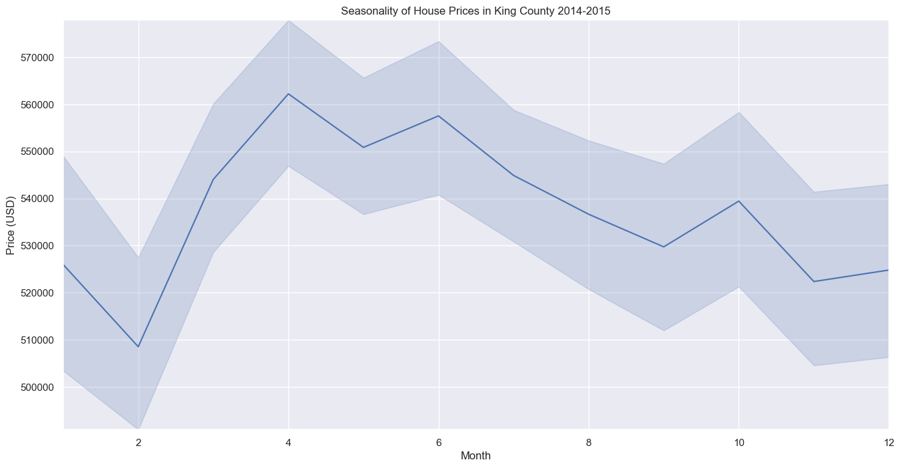
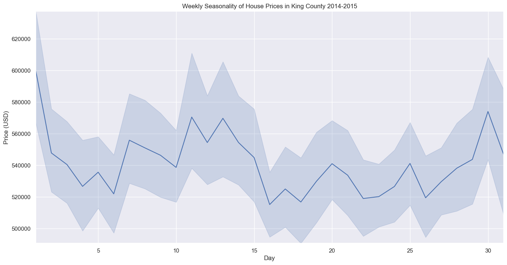
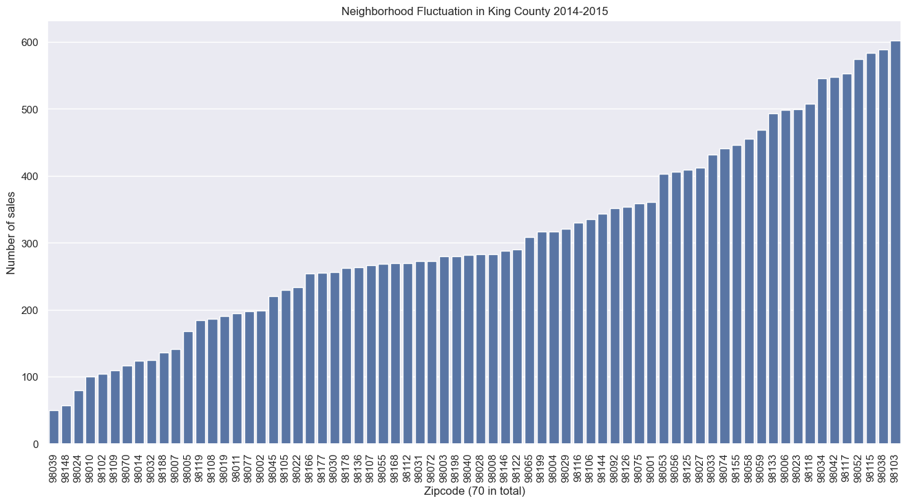

# EDA Project: King County House Sales 2014-2015

<p align="center">  

</p>

This repo contains the results of the EDA project in the neuefische Data Science, Machine Learning & AI Bootcamp. It consists of 2 notebooks:

1. The EDA notebook itself containing a classical EDA and a client-focused EDA:

    - https://github.com/jottemka/eda_neuefische/blob/82a769aa8193682e45b5cc63c326e136f3ea55d0/eda_king_county.ipynb

2. A presentation notebook that was used to generate the corresponding Jupyter slides for the stakeholder meeting:

    - https://github.com/jottemka/eda_neuefische/blob/ef8f00f8dba6c665a72b53648f7c0915470c23d3/presentation.ipynb


## Data Insights

There are 3 interesting data insights that might be contrary to common views:

1. More rooms does mean higher price, but the relationship is not as strong as one might expect.

2. Older houses are not generally cheaper. The correlation is almost zero.

3. Surprisingly, just like agricultural products, house prices exhibit seasonality effects.

## Client Recommendations

### When to buy?

We recommend buying in February and to avoid buying in April.



We also recommend buying in the middle of the month and to avoid buying in the beginning.



### Where to buy?

Based on our client's needs, we recommend low-fluctuation neighborhoods. The plot below shows all zipcode areas, ranked according to their fluctuation. Our client should pick from the neighborhoods on the left-hand side.



### What to buy?

Instead of specific buying recommendations, we decided to propose the following methodology to our (fictional) client:

1. Start with most affordable house with at least 3 bedrooms and 2 bathrooms

2. Ask yourself: would you be willing to pay for a neighborhood lower fluctuation?

The first five result of this procedure are shown in the table below. The least expensive option resulting from this procedure is a house with ID 15796 in Rainier Beach with 5 bedrooms for 133,000 USD. Notice that improving on the neighborhood can mean compromising on other aspects.

<p align="center">
<table id="T_d4bbd">
  <thead>
    <tr>
      <th id="T_d4bbd_level0_col0" class="col_heading level0 col0" >house_id</th>
      <th id="T_d4bbd_level0_col1" class="col_heading level0 col1" >price</th>
      <th id="T_d4bbd_level0_col2" class="col_heading level0 col2" >bedrooms</th>
      <th id="T_d4bbd_level0_col3" class="col_heading level0 col3" >bathrooms</th>
      <th id="T_d4bbd_level0_col4" class="col_heading level0 col4" >sqft_living</th>
    </tr>
  </thead>
  <tbody>
    <tr>
      <td id="T_d4bbd_row0_col0" class="data row0 col0" >7129304540</td>
      <td id="T_d4bbd_row0_col1" class="data row0 col1" >133000.000000</td>
      <td id="T_d4bbd_row0_col2" class="data row0 col2" >5.000000</td>
      <td id="T_d4bbd_row0_col3" class="data row0 col3" >2.000000</td>
      <td id="T_d4bbd_row0_col4" class="data row0 col4" >1430.000000</td>
    </tr>
    <tr>
      <td id="T_d4bbd_row1_col0" class="data row1 col0" >1823049182</td>
      <td id="T_d4bbd_row1_col1" class="data row1 col1" >147400.000000</td>
      <td id="T_d4bbd_row1_col2" class="data row1 col2" >3.000000</td>
      <td id="T_d4bbd_row1_col3" class="data row1 col3" >2.000000</td>
      <td id="T_d4bbd_row1_col4" class="data row1 col4" >1080.000000</td>
    </tr>
    <tr>
      <td id="T_d4bbd_row2_col0" class="data row2 col0" >2976800749</td>
      <td id="T_d4bbd_row2_col1" class="data row2 col1" >150000.000000</td>
      <td id="T_d4bbd_row2_col2" class="data row2 col2" >4.000000</td>
      <td id="T_d4bbd_row2_col3" class="data row2 col3" >2.000000</td>
      <td id="T_d4bbd_row2_col4" class="data row2 col4" >1460.000000</td>
    </tr>
    <tr>
      <td id="T_d4bbd_row3_col0" class="data row3 col0" >3356403304</td>
      <td id="T_d4bbd_row3_col1" class="data row3 col1" >154000.000000</td>
      <td id="T_d4bbd_row3_col2" class="data row3 col2" >3.000000</td>
      <td id="T_d4bbd_row3_col3" class="data row3 col3" >3.000000</td>
      <td id="T_d4bbd_row3_col4" class="data row3 col4" >1530.000000</td>
    </tr>
    <tr>
      <td id="T_d4bbd_row4_col0" class="data row4 col0" >7129300595</td>
      <td id="T_d4bbd_row4_col1" class="data row4 col1" >158000.000000</td>
      <td id="T_d4bbd_row4_col2" class="data row4 col2" >3.000000</td>
      <td id="T_d4bbd_row4_col3" class="data row4 col3" >2.000000</td>
      <td id="T_d4bbd_row4_col4" class="data row4 col4" >1090.000000</td>
    </tr>
  </tbody>
</table>
</p>

## Environment Setup
This repo contains a requirements.txt file with a list of all the packages and dependencies you will need.

Before you can start with plotly in Jupyter Lab you have to install node.js (if you haven't done it before). Check **Node version**  by run the following commands:

```sh
node -v
```

If you haven't installed it yet, begin at `step_1`. Otherwise, proceed to `step_2`.


### **`macOS`** type the following commands : 


`Step_1:` Update Homebrew and install Node by following commands:

```sh
brew update
brew install node
```

`Step_2:` Install the virtual environment and the required packages by following commands:

```BASH
pyenv local 3.11.3
python -m venv .venv
source .venv/bin/activate
pip install --upgrade pip
pip install -r requirements.txt
```
### **`WindowsOS`** type the following commands :


`Step_1:` Update Chocolatey and install Node by following commands:
```sh
choco upgrade chocolatey
choco install nodejs
```

- `Step_2:` Install the virtual environment and the required packages by following commands.

For `PowerShell` CLI :

```PowerShell
pyenv local 3.11.3
python -m venv .venv
.venv\Scripts\Activate.ps1
pip install --upgrade pip
pip install -r requirements.txt
```

For `Git-Bash` CLI :

```BASH
pyenv local 3.11.3
python -m venv .venv
source .venv/Scripts/activate
pip install --upgrade pip
pip install -r requirements.txt
```


**`Note:`**
If you encounter an error when trying to run `pip install --upgrade pip`, try using the following command:

```Bash
python.exe -m pip install --upgrade pip
```

